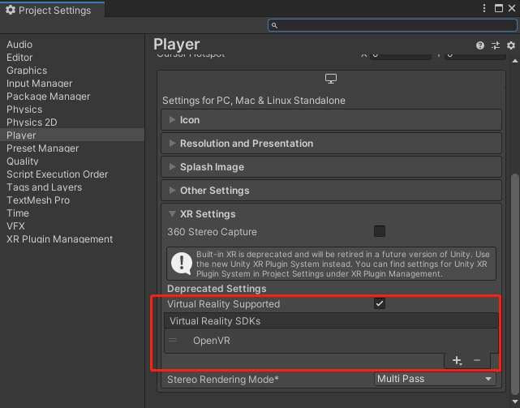
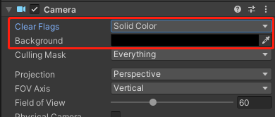

# Unity Project Package to Windows (AR) 

---

[English](./README.md) [中文](./README.zh_CN.md)

---

1. In your Unity3D project, Go to "File" >> click "Build Settings"

2. Click "Player Settings"

3. Scroll down to XR Setting >> Add OpenVR  >> after loading, back to the "Build Settings"

4. Configure the Main Camera in Scene, delete the "Skybox", background setting as rgba(0,0,0,0)

5. Select Windows Platform >> click "Add Open Scenes" >> click "Build"

6. Compress the all those build files as a ZIP folder.
