# Unreal Project Package to Windows (AR)

---

[English](./README.md) [中文](./README.zh_CN.md)

---

To make your Unreal Engine app be compatible with LarkXR AR Streaming, it has to integrate with OpenVR (SteamVR) plugin, it avaliable only at UE4, below are the steps under UE4, please also reference to Set Up a [Standing Camera for SteamVR](https://dev.epicgames.com/documentation/en-us/unreal-engine/set-up-a-standing-camera-for-steamvr?application_version=4.27)

1. In your Unreal Engine project, Go to [Edit] >> click [Plugins]

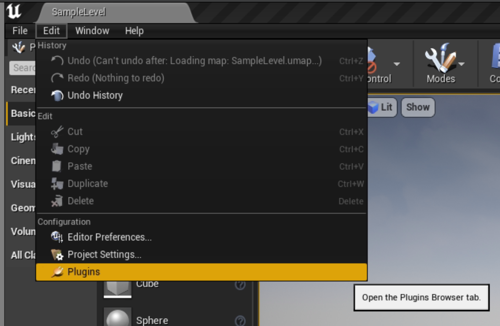

2. Make sure [SteamVR plugin] is enabled

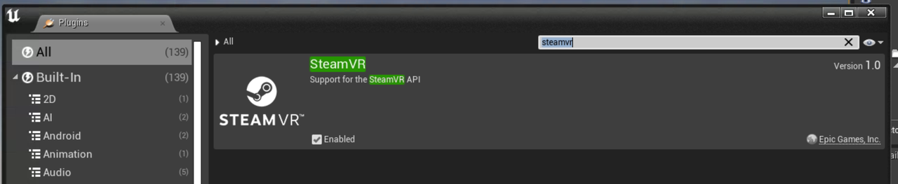

3. Go to [Edit] >> [Project Settings]

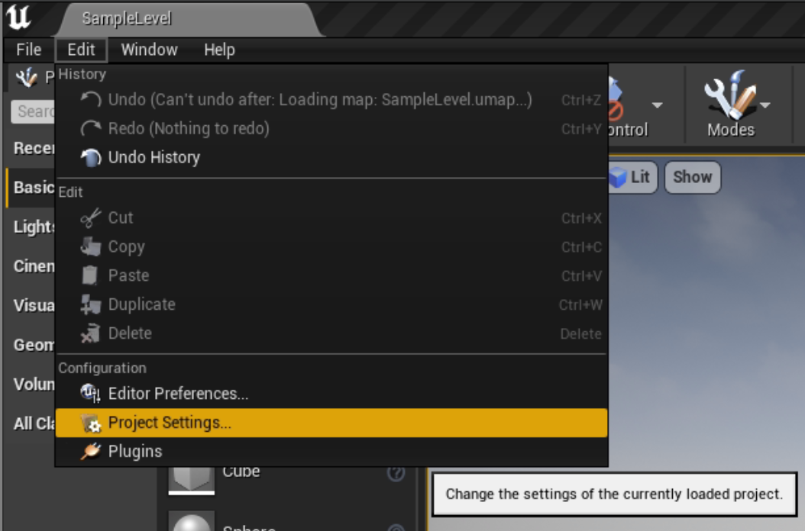

4. Go to [Description] >> [Settings] >> makes sure the [Start in VR] is enabled.

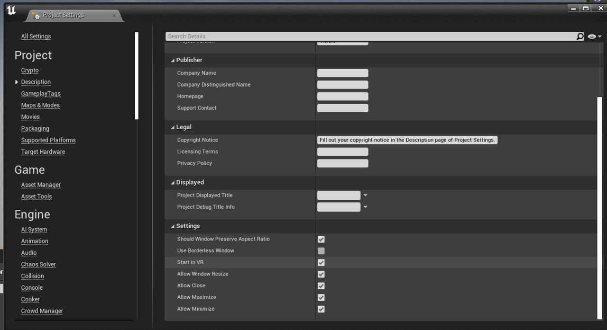

5. On the [Content Browser] tab, click [Add / Import] >> [Blueprint Class] >> click [Pawn]

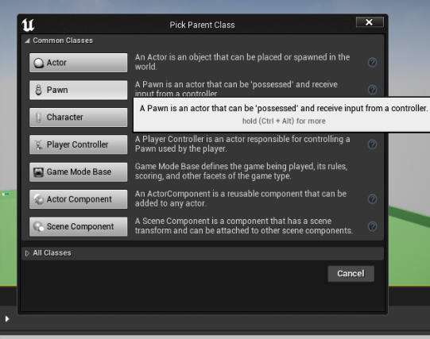

6. Double-click that newly created VRPawn >> under the [Components] tab, create a new scene and new camera.

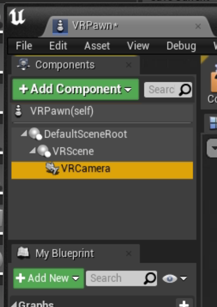

7. In the [Event Graph], create a [Set Tracking Origin], select [Floor Level]

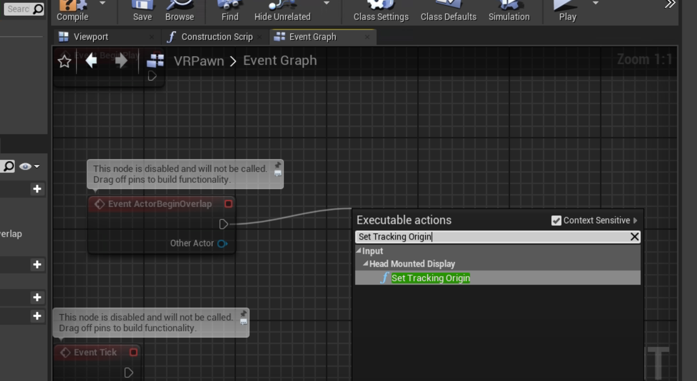

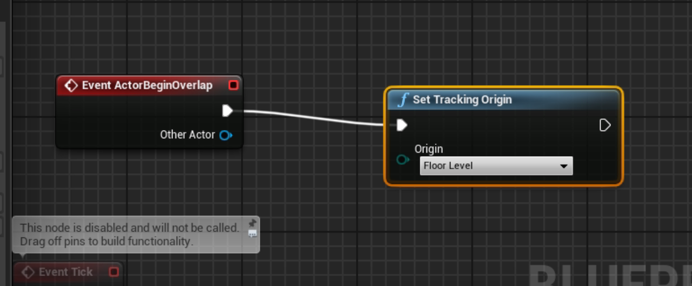

8. Drag that [VRPawn] into the scene, in [Detail], configure the [Location] as x=0.0 y=0.0 z=0.0 and [Auto Possess Player] as [Player 0]

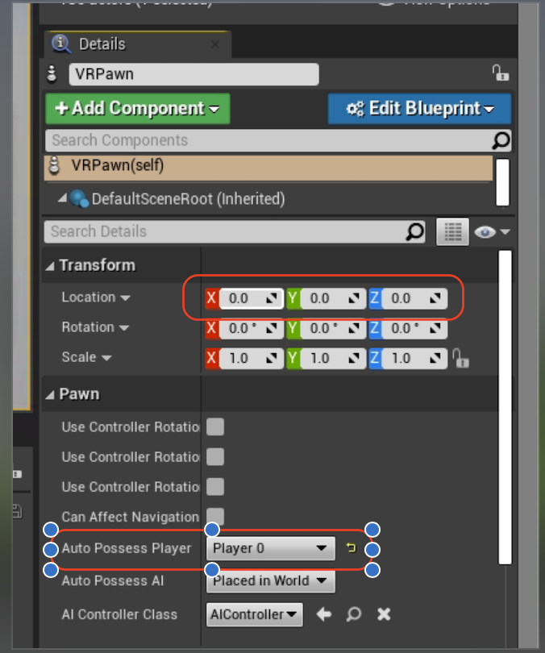

9. In the [World Outliner] tab, find [BP_Sky_Sphere],  enable [Actor Hidden In Game]

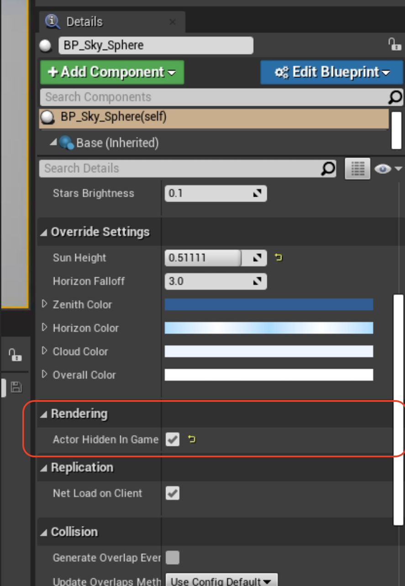

10. Go to [Edit] >> [Project Settings] >> search "alpha", in [Postprocessing], select [Allow through tonemapper]

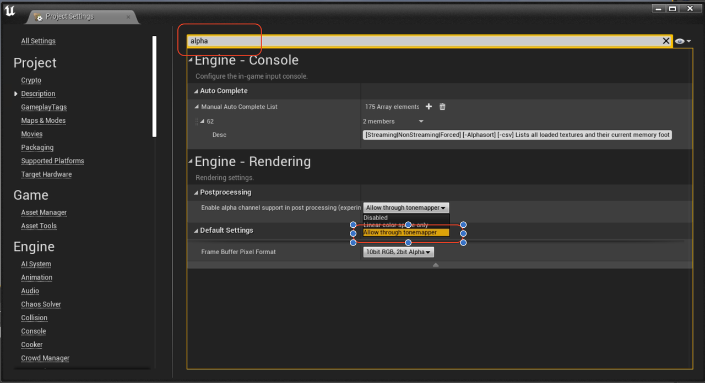

11. click "Platforms" > "Windows" > Check "Shipping" > click "Package Project"

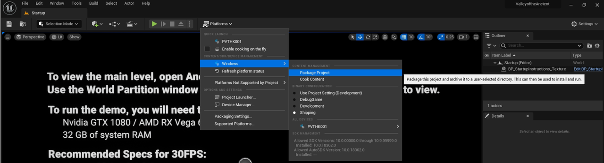

12. Compress the package folder as a ZIP folder. 